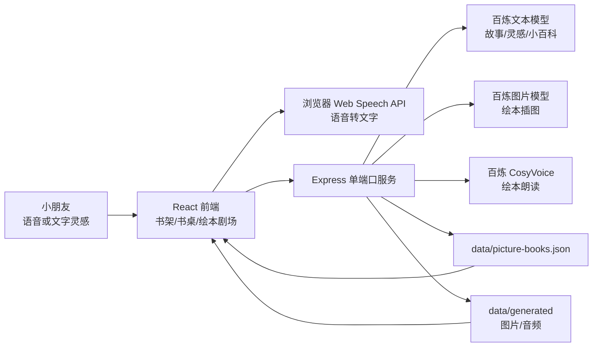
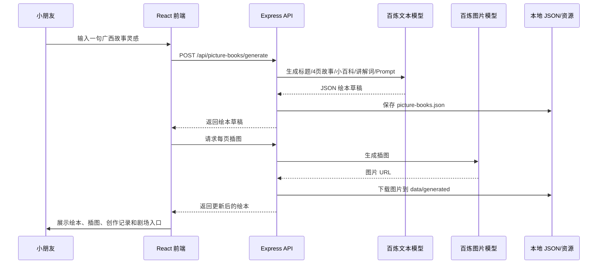

# 桂韵创想家软件架构

## 项目概览

项目名称：桂韵创想家

当前项目是一个本地运行的 Web 应用，核心目标是让小学生从一句广西文化灵感出发，完成 4 页 AI 绘本创作。系统提供灵感输入、故事生成、插图生成、朗读展示、创作记录和作品书架。

项目主线只保留绘本创编能力，服务端 API 也只暴露绘本、灵感、朗读、模型状态和静态资源相关接口。

## 技术栈

| 层级 | 技术 | 作用 |
|---|---|---|
| 前端框架 | React 19 + TypeScript | 构建书架、书桌、阅读器、剧场和创作记录 |
| 构建工具 | Vite 7 | 构建前端静态资源，旧双端口调试时提供开发服务器 |
| UI 图标 | lucide-react | 麦克风、朗读、书本、删除、进度等图标 |
| 后端框架 | Express 5 + TypeScript | 提供绘本生成、朗读、保存和资源服务 |
| 运行工具 | tsx + Vite build | 默认单端口启动：先构建前端，再由 Express 托管页面和 API |
| 本地存储 | JSON 文件 | 保存绘本作品、生成资源和创作记录 |
| 绘本文本模型 | 阿里云百炼 DashScope 兼容 OpenAI 接口 | 生成故事、小百科、Prompt 和灵感锦囊 |
| 绘本图片模型 | 阿里云百炼 `wan2.7-image-pro` | 生成 4 页绘本插图 |
| 绘本 TTS | 阿里云百炼 CosyVoice WebSocket | 生成绘本朗读音频并缓存 |
| 浏览器能力 | Web Speech API + SpeechSynthesis | 语音输入和浏览器朗读兜底 |

## 目录结构

```text
.
├── src/
│   ├── product/
│   │   ├── ProductShelfApp.tsx      # 产品主界面：书架、书桌、阅读、剧场、记录
│   │   ├── pictureBookApi.ts        # 前端 API 调用
│   │   ├── productCopy.ts           # 展示文案清洗
│   │   ├── productSpeech.ts         # 朗读播放和浏览器兜底
│   │   └── productShelf.css         # 产品样式
│   ├── App.tsx                      # 经典绘本工坊页面
│   ├── main.tsx
│   └── styles.css
├── server/
│   ├── index.ts                     # Express 单端口入口
│   ├── bailian.ts                   # 百炼文本、灵感锦囊、图片生成
│   ├── bailianTts.ts                # 百炼 CosyVoice TTS
│   ├── bookStore.ts                 # 绘本数据模型与保存
│   └── guangxiFallback.ts           # 广西文化本地 fallback 绘本
├── scripts/
│   ├── run-workbuddy-service.sh     # WorkBuddy 守护进程
│   ├── product-shelf-smoke.mjs      # 单端口页面冒烟测试
│   └── product-shelf-full-flow.mjs  # 端到端生成流程测试
├── data/
│   ├── picture-books.json           # 绘本作品，本地生成
│   └── generated/                   # 生成图片、占位图、朗读音频
├── docs/
├── start.sh                         # WorkBuddy 推荐启动入口
├── vite.config.ts
├── package.json
└── .env.example
```

## 总体架构



## 前端模块

前端主界面在 `src/product/ProductShelfApp.tsx`，通过 hash route 管理页面：

| 路由 | 作用 |
|---|---|
| `#/shelf` | 我的绘本书架 |
| `#/desk` | 我的书桌，输入灵感并生成绘本 |
| `#/book/:bookId` | 绘本阅读页 |
| `#/book/:bookId/theater` | 绘本剧场 |
| `#/book/:bookId/records` | 创作记录 |
| `#/records` | 所有作品的创作记录 |
| `#/about` | 项目介绍 |

主要前端状态：

| 状态 | 含义 |
|---|---|
| `idea` | 当前输入的一句话灵感 |
| `books` | 书架摘要列表 |
| `activeBook` | 当前打开的完整绘本 |
| `bookLanguage` | 中文或英文绘本 |
| `protagonistGender` | 主角小朋友是女孩或男孩 |
| `shouldGenerateImage` | 是否一次生成 4 页插图 |
| `progress` | 绘本生成阶段、计时、插图任务状态和公开草稿流 |
| `readingMode` | 当前朗读状态 |

## 单端口运行模型

当前项目默认使用单端口模式运行。`npm run dev` 会先执行前端构建，把 React 应用输出到 `dist/`，然后启动 Express 服务。Express 默认监听 `HOST=127.0.0.1` 和 `PORT=8787`，同时负责三类请求：

- `/` 和前端路由：返回 `dist/index.html`。
- `/assets/...`：返回前端构建后的 JS、CSS 和图片资源。
- `/api/...` 与 `/generated/...`：返回后端接口、本地生成图片和朗读音频。

浏览器只需要访问 `http://127.0.0.1:8787`。旧的 `5173 + 8787` 双端口方式只保留为 `npm run dev:split`，用于临时调试 Vite 开发服务器。

如果需要让局域网内其他设备访问，可以在 `.env` 中设置 `HOST=0.0.0.0`。本机仍可访问 `http://127.0.0.1:8787`。

## WorkBuddy 守护启动

WorkBuddy 或其他启动器推荐调用：

```bash
./start.sh
```

`start.sh` 会启动后台守护进程，执行 `scripts/run-workbuddy-service.sh`：

- 缺少 `node_modules/` 时自动运行 `npm install`。
- 每次启动先运行 `npm run build`，确保 Express 托管最新 `dist/`。
- 运行 `npm run api` 提供单端口服务。
- 如果服务异常退出，等待几秒后自动重启。
- PID 写入 `.run/`，日志写入 `logs/guixiaoya.log`。
- 启动前检查 `8787` 端口，能清理同项目残留进程，也会拦住其他程序占用端口的情况。

可用控制命令：

```bash
./start.sh status
./start.sh restart
./start.sh stop
./start.sh logs
```

## 后端 API

Express 服务默认运行在 `127.0.0.1:8787`。在默认单端口模式下，页面、`/api` 接口和 `/generated` 资源都由这个服务提供。

| 方法 | 路径 | 作用 |
|---|---|---|
| `GET` | `/api/health` | 健康检查 |
| `GET` | `/api/bailian/status` | 查看百炼模型配置状态 |
| `POST` | `/api/speech` | 使用百炼 TTS 合成绘本语音 |
| `POST` | `/api/inspiration-chips` | 生成或 fallback 灵感锦囊 |
| `GET` | `/api/picture-books` | 获取绘本书架摘要 |
| `GET` | `/api/picture-books/:id` | 获取完整绘本 |
| `POST` | `/api/picture-books/generate` | 根据一句灵感生成绘本草稿，可选同时生成插图 |
| `POST` | `/api/picture-books/:id/speech/preload` | 预生成绘本每页朗读音频 |
| `POST` | `/api/picture-books/:id/pages/:pageNumber/image` | 重新生成单页插图 |
| `DELETE` | `/api/picture-books/:id` | 删除绘本 |

## 绘本生成流程



## AI 模型分工

阿里云百炼 / DashScope 用于当前项目的主要多模态能力：

- 灵感锦囊：默认 `qwen-turbo`
- 绘本故事：默认 `deepseek-v4-pro`
- 通用文本配置：默认 `qwen3.7-max`
- 图片生成：默认 `wan2.7-image-pro`
- 图片尺寸：默认 `1K`
- 绘本朗读：默认 `cosyvoice-v3-flash`
- 女孩声音：默认 `longling_v3`
- 男孩声音：默认 `longjielidou_v3`

对应文件：

- `server/bailian.ts`
- `server/bailianTts.ts`

## 数据模型

### PictureBook

绘本作品保存在 `data/picture-books.json`，主要字段包括：

| 字段 | 含义 |
|---|---|
| `id` | 绘本 ID |
| `title` / `subtitle` | 标题和副标题 |
| `originalIdea` | 小朋友原始灵感 |
| `language` | `zh` 或 `en` |
| `protagonistGender` | `girl` 或 `boy` |
| `heritageElements` | 广西文化亮点 |
| `tourismElements` | 广西文旅元素 |
| `guidingQuestions` | AI 引导问题 |
| `outline` | 故事路线 |
| `pages` | 4 页绘本页面 |
| `tourGuideScript` | 小小文旅推荐官讲解词 |
| `studentReflection` | 学生创作小记 |
| `aiContentRatio` | AI 内容占比 |
| `promptRecords` | 创作 Prompt 记录 |

### PictureBookPage

| 字段 | 含义 |
|---|---|
| `pageNumber` | 页码 |
| `title` | 单页标题 |
| `text` | 单页绘本正文 |
| `imagePrompt` | 单页图片 Prompt |
| `imageUrl` | 插图资源地址 |
| `imageSource` | `bailian` 或 `placeholder` |
| `cultureNote` | 单页文化小百科 |
| `speechAudioUrl` | 单页朗读音频地址 |
| `speechAudioText` | 音频对应文本 |

## Fallback 与稳定性设计

为了适合比赛演示，项目做了多层兜底：

- 百炼 API key 缺失时，使用 `guangxiFallback.ts` 本地生成演示绘本。
- 百炼文本生成失败时，切换成本地 fallback 绘本。
- 百炼图片生成失败时，生成本地 SVG placeholder 插图。
- 百炼 TTS 失败时，前端使用浏览器 `speechSynthesis` 兜底朗读。
- 图片、音频下载到 `data/generated/`，前端通过 `/generated/...` 访问，减少外部 URL 失效风险。
- `bookStore.ts` 使用简单队列避免同时更新同一本绘本时写文件冲突。
- WorkBuddy 启动脚本会自动重启异常退出的服务。

## 安全与隐私

- API key 只放在后端 `.env` 中，不进入前端 bundle。
- 前端通过 `/api` 调用后端，不能直接看到模型 key。
- 图片 Prompt 明确禁止可读文字、水印、Logo、界面文字等，降低生成乱码和不合适内容的概率。
- `data/`、`.run/`、`logs/` 和 `.env` 都不提交到 Git。

## 本地运行

安装依赖：

```bash
npm install
```

创建 `.env`，参考 `.env.example` 填入百炼 key。

启动单端口环境：

```bash
npm run dev
```

访问：

```text
http://127.0.0.1:8787
```

WorkBuddy 推荐启动：

```bash
./start.sh
```

仅在需要旧的前后端分离调试方式时运行：

```bash
npm run dev:split
```

手动构建：

```bash
npm run build
```

## 当前能力边界

当前版本适合单机本地演示，还不是多人在线系统：

- 没有用户登录。
- 没有数据库，使用本地 JSON 文件。
- 没有多人协作权限控制。
- 没有复杂后台管理系统。
- 没有视频生成。
